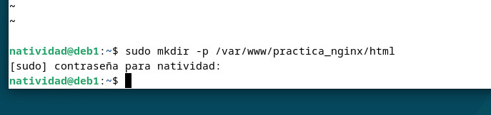
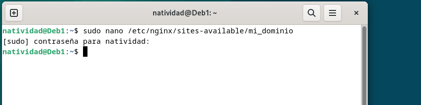
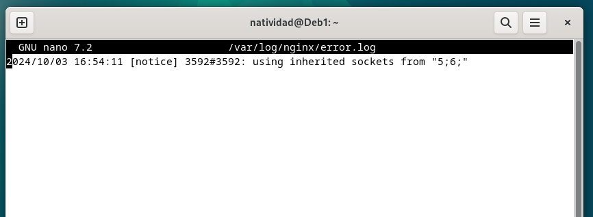
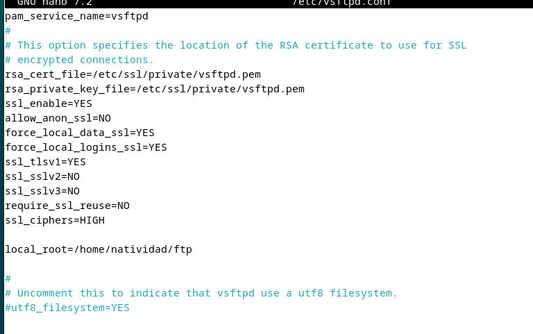
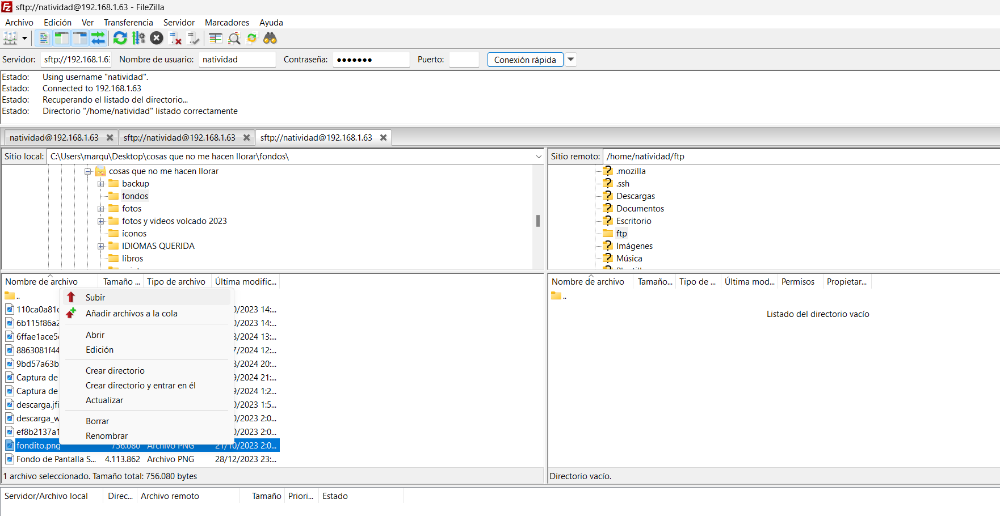
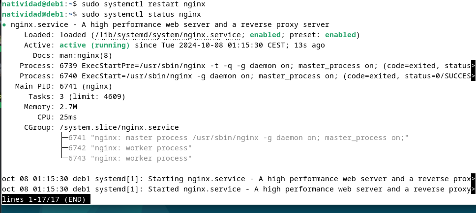

### Natividad Márquez Baena

# Instalación y configuración de un Servidor Debian

 1. [Instalación servidor web Nginx](#1)
 2. [Creación de las carpeta del sitio web](#2)
 3. [Configuración de servidor web NGINX](#3)
 4. [Comprobaciones](#4)
 5. [FTP](#5)
 6. [HTTPS](#6)

<div id="1"></div>

## 1.Instalación servidor web Nginx

Para la instalación de un **servidor web nginx**, previamente se han de actualizar los repositorios. Posteriormente se realizará la instalación con `sudo apt install nginx`


Finalmente se hace una comprobación mediante `systemctl status nginx`.


<div id="2"></div>

## 2.Creación de las carpeta del sitio web

Primeramente se creará una carpeta donde se almacenará el dominio. El nombre de este es de libre
elección:

Posteriormente se clonará un repositorio en dicha carpeta:

Es importante otorgar permisos como propietario de esta carpeta y todo su contenido, al usuario www-data, que generalmente es el del servicio web. Además le otorgaremos los permisos adecuados para evitar errores.

Para comprobar el buen funcionamiento del servidor se hace uso de `ip a`, accediendo desde nuestro cliente
con un navegador.


Esta ultima imagen nos indica que el servidor está en pleno funcionamiento.

<div id="3"></div>

## 3.Configuración de servidor web NGINX

En Nginx existen dos rutas clave. La primera es `sites-available`, que almacena los archivos de configuración de los bloques o hosts virtuales disponibles en el servidor. 

La segunda es `sites-enabled`, donde se encuentran los archivos de configuración de los sitios que están activos y operativos en ese momento.

Dentro de `sites-available` se incluye un archivo de configuración por defecto (default), el cual corresponde a la página que se muestra cuando se accede al servidor sin especificar un sitio web, o si no se encuentra el sitio solicitado, por ejemplo, la página que se vio con anterioridad.

Para que Nginx presente su contenido, es necesario definir un bloque de servidor con las directivas adecuadas. En lugar de editar directamente el archivo de configuración predeterminado, crearemos uno nuevo, donde `nombre_web` será uno que se otorgue de manera libre.



El contenido del archivo creado será el siguiente:


También crearemos un enlace simbólico entre este archivo y el directorio de sitios habilitados, de modo que el sitio se active automáticamente.


Finalmente reiniciamos el servidor con `sudo systemctl restart nginx`.

<div id="4"></div>

## 4.Comprobaciones
En este apartado se realiza la comprobación del correcto funcionamiento del servidor y los registros del servidor. Dado que aún no contamos con un servidor DNS que traduzca nombres a direcciones IP, tendremos que hacerlo manualmente. Para ello, editaremos el archivo `/etc/hosts`, de nuestra máquina anfitriona, asignando la IP de la máquina virtual a nuestro server_name (mi_dominio).


En sistemas Linux, este archivo se encuentra en: `/etc/hosts`
En Windows, está ubicado en: `C:\Windows\System32\drivers\etc\hosts`
Se deberá añadir `192.168.X.X nombre_web`, sustituyendo los dos ultimos dígitos por los de la IP de la máquina virtual. Además de cambiar el nombre al de nuestro dominio.

Una vez comprobado el funcionamiento del servidor, se procede a la comprobación de los registros del servidor. Se verificará que las solicitudes se estén registrando correctamente en los archivos de logs, tanto las correctas como erróneas.



<div id="5"></div>

## 5.FTP

Para transferir archivos desde la máquina anfitriona a la máquina virtual o servidor remoto, el método mas empleado suele ser Github, sin embargo, en esta practica se emplea una alternativa, el FTP un Protocolo de transferencia de archivos entre sistemas conectados en una red TCP.

Actualmente lleva aplicada la extension SSH (Secure Shell Prococol) para implementar un canal seguro de transferencia de archivos con cifrado.

Para configurar un servidor SFTP en la máquina virtual de Debian, se han de actualizar previamente los repositorios y realizar la instalacion de vsftpd.


A continuación crea una carpeta con el home de Debian


Posteriormente se crean los certificados de seguridad necesarios para la capa de cifrado a nuestra conexión. En este paso se realiza la configuración propiamente dicha del vsfptd.
Eliminamos las primeras lineas del archivo:

```
rsa_cert_file=/etc/ssl/certs/ssl-cert-snakeoil.pem
rsa_private_key_file=/etc/ssl/private/ssl-cert-snakeoil.key
ssl_enable=NO
```
Y posteriormente se añaden las siguientes lineas, sin olvidar modificar la última de ella con el nombre del `home` escogido con anterioridad.

```
rsa_cert_file=/etc/ssl/private/vsftpd.pem
rsa_private_key_file=/etc/ssl/private/vsftpd.pem
ssl_enable=YES
allow_anon_ssl=NO
force_local_data_ssl=YES
force_local_logins_ssl=YES
ssl_tlsv1=YES
ssl_sslv2=NO
ssl_sslv3=NO
require_ssl_reuse=NO
ssl_ciphers=HIGH

local_root=/home/nombre_usuario/ftp
```




Finalmente se reinicia el servicio para aplicar los cambios.


Actualmente ya sería posible el acceso al servidor mediante un cliente FTP. En esta practica se ha empleado el cliente `Firezilla`, que se descargará previamente.
Existen dos maneras de acceder:
Mediante el puerto por defecto del protocolo inseguro FTP, el 21, pero utilizando certificados que cifran el intercambio de datos convirtiéndolo así en seguro, o mediante el puerto 22, con una conexión similar a SSH.

En el casi del puerto 21 se espera obtener el siguiente certificado.


Si se utiliza el puerto 22, se han de rellenar los datos de usuario y contraseña para conectar con el servidor, además de la IP de la máquina virtual Debian.
Previamente se escoge un archivo como ejemplo de transmision de datos entre la maquina anfitriona y la virutal.

En el entorno gráfico de Firezilla, desde el directorio local, nevegamos hacia la carpeta donde está el archivo escogido de ejemplo. Se marca el directorio del servidor remoto al que queremos hacer la transmision del archivo. Posteriormente seleccionamos el archivo con clic derecho y seleccionamos **subir**. 

Tras esperar unos instantes, el archivo se habrá trasnmitido al directorio de la máquina virtual.
Se realiza una comprobación desde el entorno gráfico navegando hacia el directorio final y comprobando que, efectivamente el archivo se ha transmitido correctamente.


<div id="6"></div>

## 6.HTTPS
Es necesario añadir una capa de seguridad al servidor, de manera que todos los sitios web alojados accedan siempre mediante certificados de SSL, con el uso de HTTPS. Con este certidicado se encriptará la conexion entre el servidor y el cliente.


Para generar un certificado autofirmado SSL y una clave privada se emplea el siguiente comando:


A continuación se modifica el archivo de texto, con el fin de establecer la configuración del dominio, donde se define la dirección IP del dominio, el nombre del servidor (en este caso mi_dominio),los puertos certificados SSL y otras directrices. 


En este punto, para comprobar la configuración del servidor nginx se emplea el comando `sudo nginx -t`. Con esto se verifica que los archivos de configuración tengan una correcta sintaxis y sean válidos.


Posteriormente se reinicia el servicio de nginx para aplicar los cambios y efectuarlos.



Finalmente, todo está listo para acceder al servidor creado


